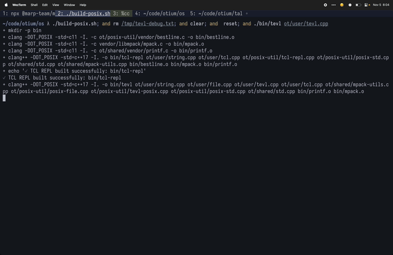
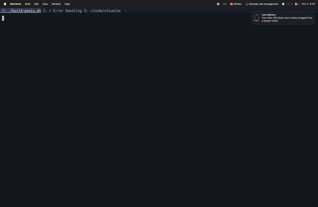

# build your own text editor


- [kilo: https://github.com/antirez/kilo](https://github.com/antirez/kilo)
- [tutorial: https://viewsourcecode.org/snaptoken/kilo](https://viewsourcecode.org/snaptoken/kilo/)

<!--
wanted to make a text editor for my operating system

good to have something where i understand the internals and how to alter them because e.g. files and
displays don't work normally yet

https://vt100.net/docs/vt100-ug/
-->

---

# a quick demo 



<!-- 
demo tevl 
-->

---

# it's cool that things work

<!-- 
one thing os development drives home, a lot of work goes into making basic things function well

if you've ever modded your editor to the point where it's unreliable

it's very anxiety inducing
-->

---

# list of bugs 

11/3
- first line doesn't render
- 23rd line doesn't render
- scrolling down doesn't work right, requires two presses to do anything and renders the wrong thing
- random ] appears at the end of line sometimes (part of an escape sequence?)

<!-- i wrote a lot of bugs so i started writing them down -->

---

# list of bugs II

11/4
- editor starts on the second line and you can't scroll up
- you can scroll up with mouse but then the first line prints repeatedly
- horizontal scroll doesn't work
- horizontal scroll kind of works, but tons of empty space at the end and going up doesn't snap back
- arrow up snaps to the end of the line instead of the char after it
- a bunch of tildes surf across the screen
- status line goes across multiple lines

---

# list of bugs III

11/5
- backspace erases entire line
- backspacing over tabs doesn't work right
- backspace erases two characters
- can't quit editor

---

# some of the bugs look pretty neat though



---

# when i got text entering to work but only the letter a

 

---

# why so many bugs?

mostly because of terminals

<!-- 

a really big chunk of the tutorial is basically dealing
with terminals and how to control them

-->

---

# what is a terminal?

video terminal 100 (vt100)


---

# what is a terminal emulator?

something that emulates a terminal like the vt100 in a different display architecture

---

# how do you control a terminal

* operating system calls set up the "mode" of the terminal emulator
* you control a terminal with sequences of bytes
* terminal control sequences:
  ```
  ESCAPE character: 27 or 033 (octal) or 1b (hex) 
  followed by more characters
  ex
  ESC[2J clear screen
  ESC[H move cursor to top
  ESC[34m make foreground blue
  ```

---

# what's hard there

* it's stateful but little visibility into that state
* there isn't a 1:1 correlation between bytes and things displayed on the screen
* (control characters, tabs, unicode)
* platform differences

<!-- 
there can also be platform differences
-->

---

# should you build your own text editor?

* it was fun
* something like curses/graphics probably easier
* lots more work to get to where it'd be usable day to day

<!--
it was fun: good for learning another language

i'd probably skip the terminal control part and use a library

there's a lot of things you'd need to make it usable
-->

---

# thanks

ESC[2J (clear entire screen)

