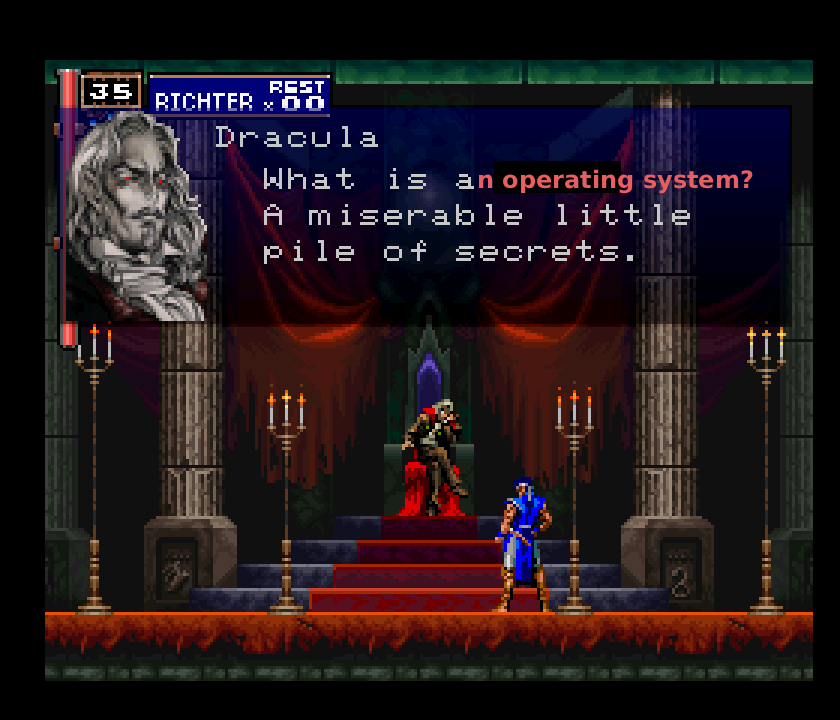
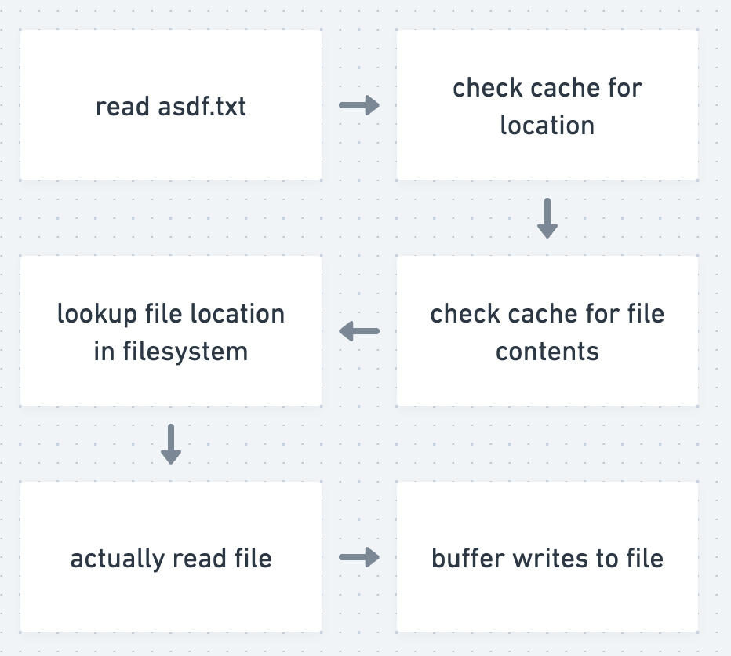

<style>
    .float-left{
    height:500px;
    float:left;
    }
    .float-right {
    float:right;
    height:500px;
    }
</style>


# otium

# [https://otium.sh](https://otium.sh)

<!-- 

hi i'm phil

for the first half of my batch at RC i worked on a little operating system

it's available at this URL if you want to check it out

today i wanted to talk about some of the things i learned about while working on the operating system

-->

---

# what even is an operating system



<!--
what even is an operating system?
--->

---

# an operating system

- "manages computer hardware and software resources" (Wikipedia)
- "controls all other all other programs that run on a computer" - (reddit /r/explainlikeimfive)
- "handles core tasks like memory management, process scheduling, file management" - google ai

<!--

the google ai answer is actually the most interesting to me

the operating system provides abstractions which i will refer to as lies that allow programs to be written simply even though they're not

-->

---

# lie #1: code executes sequentially

```python
print("one")
print("two")
print("three")
```

<!-- 
here we have a nice little sequential program

these statements are definitely going to execute one after the other
-->

---

# here's where it gets complicated

* this code is executed on the processor
* other programs would also like to use the processor
* but the processor has finite resources
* even with multi core processors you still have way less than &lt;running programs worth of resources

---

# so our nice sequential program

```python
# might get interrupted here
print("one")
# or here
print("two")
# or even here
print("three")
```

<!--

so doesn't matter whether your program is single threaded or not

-->

---

# a scheduler

- the component that handles this is a scheduler
* interleaves execution of different programs
* has to handle potentially bad programs
    * ex what if we do `while(true) continue;`
* has to handle saving registers and other finite resources 

<!--

-->

---

# pretty hard to implement


<!--
is a concurrent program
is the engine of concurrency

-->

---

# lie #2: memory is infinite

```python
int main(void) {
  void* mem = malloc(1024);
  printf("%p\n", mem);
}
```

* when I run this program, I get something like `0x14d808800`
* is this an offset into ram? 

<!--
when i run this program which just allocates a little bit of memory and prints out its address
-->


---

# virtual memory 

- `0x14d808800` does not guarantee a physical spot in ram
* only the operating system can access memory by its physical address
* it might not even be backed by ram!
    * memory might be copied to storage and back (swap)
* so `0x14d808800` gets looked up in a table the operating system has
    * something like `(*mem) = 5;` might actually be pretty complicated

<!--

because of virtual memory subsystem, it is not a physical address
-->

---

# why?


<!-- 
there are many reasons for virtual memory, but one is that ram is expensive

like say you have the new 128gb macbook pro, but you also want to open a web
browser and slack at the same time, so you don't have enough memory. virtual
memory is what lets you do that.

--->

---

# lie #3: storage devices are simple key/value stores

```python
with open("./asdf.txt", "r") as f:
    stuff = f.read()
with open('./asdf.txt', "w") as f:
    f.write("hello world!")
```

* does this code translate to simple, physical operations that happen in sequence?

* (does that sound familiar?)

<!-- we're almost done hang in there -->

---

# but filesystems

<!---->


<!--
```python
# check if location of the file is cached in memory
with open("./asdf.txt", "r") as f:
    # check if contents are cached in memory
    # if not, walk through filesystem structures to find physical location
    # actually read the storage
    stuff = f.read()
# same as above
with open('./asdf.txt', "w") as f:
    # buffer small writes to the storage in case more happens
    f.write("hello world!")
```
-->

<!-- 
* check to see if the location of the file is cached in memory
* check to see if contents are cached in memory
* walk through filesystem structures to find the actual physical location
* actually read the storage
* buffer writes to the storage in case more happen
-->

---

# thank you operating systems

- operating systems are tricky
* abstractions: actually pretty great
    * i apologize for calling them lies

<!-- 
if that feels like a lot, it's because it is

my main takeaway from this is that i as a non operating systems developer don't have to worry about this stuff too much, but that's because a lot of people did, a lot

abstractions actually pretty great i can't wait to get a job again and allocate memory with reckless abandon 

-->

---

# thank you recurse

## Operating Systems: Three Easy Pieces

[https://ostep.org](https://ostep.org)

## my lil os

[https://otium.sh](https://otium.sh)

<!-- 
if you found any of these things interesting, ostep is a good book

each of the sections of this book correspond to a section of the book

we're also meeting tomorrow to discuss the last chapters of it, so come hang out
-->
